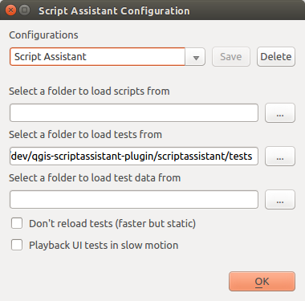
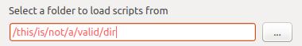

=============
Configuration
=============

The Script Assistant plugin is configured using the settings dialog. The plugin is designed to hold multiple project configurations, so that it's easy to switch between development tasks.

The Settings Dialog
===================

Default settings
----------------

The plugin comes with one configuration pre-installed - this configuration allows the plugin to test itself.

On install, you can immediately select the Test Scripts button.

User settings
-------------

To add a new Script Assistant configuration, change the name in the configuration combo box and then type in or select the appropriate settings in the dialog. Click Save to store the configuration.

Don't reload tests setting
~~~~~~~~~~~~~~~~~~~~~~~~~~

This setting turns off the use of ``reload()`` to reload test modules. It'll run tests faster but the test won't update if it has been edited in an external text editor.

Directory validation
--------------------

Directories displayed in red text cannot be found in the file system so are invalid. The Save action is unavailable if there are invalid directories.

Save confirmation
-----------------

If settings have been modified but not yet saved, an asterisk is displayed in the dialog title.

If a dialog is closed in any way with unsaved settings, the user will be asked to confirm via the Save Confirmation dialog. If the user opts not to save, the settings entered into the settings dialog will still be used for the current QGIS session - but they won't be available in subsequent QGIS sessions.

The Settings Configuration File
===============================

Settings are saved to a configuration file stored in the ``.qgis2/scriptassistant`` directory in the user folder (the exact location differs depending on operating system). If a group of users require similar configurations, the settings file can be shared between users. User directories will need to be amended.

The settings file should generally be modified by changing settings in the settings dialog, not by directly editing it. It is provided in .ini format for convenience.
