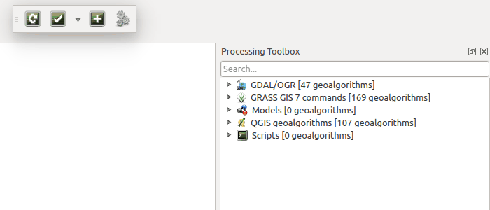
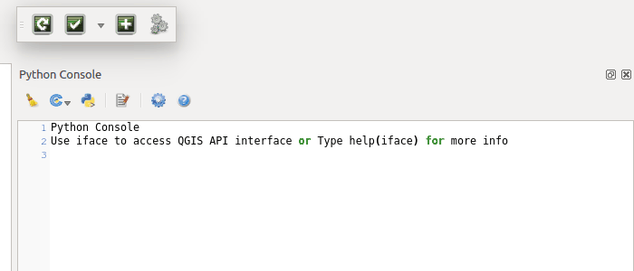
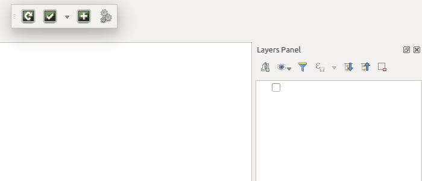

========
Overview
========

This is a QGIS plugin with three helper tools for QGIS development purposes.

Reload Scripts
==============

Load / reload processing user scripts into QGIS from any existing directory.

The Reload Scripts tool simply copies processing scripts from the configured directory to the QGIS processing scripts directory, and then reloads the processing toolbox in QGIS. If a script already exists with the same name, it will be overwritten without warning.

Test Scripts
============

.. image:: images/test_scripts.png
    :align: center

Run tests within QGIS in a way that makes them configurable for local and Travis-CI testing without any manual amendments.

The test list
-------------

The test list is constructed by finding any file in the configured test directory with a file name starting with ``test_`` and ending with ``.py``. It does not (currently) check folders within the test directory.

Every time you select the dropdown to the right of the Test Scripts button, the test list reloads from the tests directory. So if you're switching branches in git, you'll always be running the tests from the same branch you've checked out.

Running a test
--------------

Select a test from the test list to run it.

The QGIS Python Console will be opened (if it isn't already visible) to print test results.

``reload()`` is used to reload the test module. This allows the tests to be edited using an external text editor and then recompiled in QGIS. This functionality can be switched off in settings if it isn't required.

Running a test will also apply that test as the default action for the Test Scripts button - to repetitively run the same test, there is no need to select it from the test list again and again, just click on Test Scripts after the first run.

Running all tests
-----------------

There is always an additional option in the test list to run all tests. This option collects tests in the same way that the test list is constructed and runs the lot.

Testing using Travis-CI
-----------------------

The plugin `repository <https://github.com/linz/qgis-scriptassistant-plugin`>_ contains an example of how to run these same tests using Travis-CI.

Thanks to Boundless for making this possible using `qgis-testing-environment-docker <https://github.com/boundlessgeo/qgis-testing-environment-docker>`_!

Add Test Data
=============

Add all of the test data referred to in a test with a click.

Adding shapefiles used in tests
-------------------------------

The Add Test Data tool checks the last test script that was run for references to ``.shp`` files. Any shapefile matches from the configured testdata directory are then added to the QGIS layer registry.
