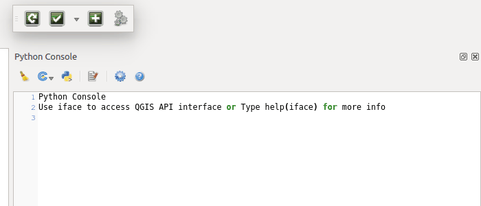

========
Overview
========

This is a QGIS plugin with three helper tools for QGIS development purposes.

Reload Scripts
==============

Load / reload processing user scripts into QGIS from any existing directory.

.. image:: images/reload_scripts.gif
    :align: center

Run Tests
=========

Run tests within QGIS in a way that makes them configurable for local and Travis-CI testing without any manual amendments.

Add Test Data
=============

Add all of the test data referred to in those tests with a click.

.. image:: images/add_test_data.gif
    :align: center
